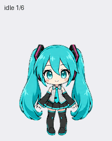

# ミク — 個人利用のChatGPT Pet

初音ミクをモチーフに作成した、青緑のツインテールのちびキャラPetです。このプライベートリポジトリは、**別端末・別のChatGPT Enterpriseアカウントへの画像の持ち込み**とバックアップ用です。



## 使用する画像

| ファイル | 用途 | 仕様 |
| --- | --- | --- |
| [spritesheet-web-v1.png](assets/spritesheet-web-v1.png) | EnterpriseのWeb画面からアップロードする場合 | 1536×1872、透明PNG、9種類の動き・57コマ |
| [spritesheet-v2.png](assets/spritesheet-v2.png) | v2対応のPetsツールから登録する場合 | 1536×2288、透明PNG、9種類の動き＋16方向の視線・73コマ |

Web用v1は、検証済みv2の先頭9行のコマをそのまま組み直した互換版です。絵の再生成・引き伸ばしはしていません。両画像はローカル検査とPetsの事前検証に合格しています。

## 1. 別端末にダウンロード

GitHubへ、このプライベートリポジトリにアクセスできるGitHubアカウントでログインしてください。GitHubの認証とChatGPT Enterpriseの認証は別です。

- ブラウザー：このリポジトリの **Code → Download ZIP** から取得し、ZIPを展開します。
- GitHub CLIを使う場合：

```sh
gh auth login
gh repo clone Dragongame7/miku-chatgpt-pet
cd miku-chatgpt-pet
```

画像をアップロードするときは、GitHubのページURLではなく、ダウンロードしたPNGファイルを指定します。

## 2. 別のEnterpriseアカウントのWeb画面で登録（推奨）

1. 利用先のChatGPT Enterpriseアカウントへログインし、対象のEnterpriseワークスペースを選びます。
2. **Settings → Personalization → Pet → Select pet** を開きます。
3. **Upload pet** で `assets/spritesheet-web-v1.png` を選びます。
4. 名前は「ミク」にします。説明欄がある場合は「初音ミクをモチーフにした、青緑のツインテールが特徴のちびキャラPet。個人利用。」を入力します。
5. 登録された「ミク」を選択します。

WebのPets提供状況はアカウント・ワークスペースによって異なります。設定項目が表示されない場合は、そのEnterprise環境でPetsが利用可能か管理者に確認してください。

上記の設定場所とWebアップロード形式は、[OpenAI公式Petsガイド](https://learn.chatgpt.com/docs/pets)に基づきます（確認日：2026-10-08）。公式ガイドのWeb形式は1536×1872・20 MiB以下です。このため、Webにはv1を選び、v2の対応を推測してアップロードしないでください。

## 3. v2対応のPetsツールで登録する場合

別端末のアプリ／チャットにPetsプラグインが接続され、`validate_pet_spritesheet`、`prepare_pet_upload`、`create_pet` が利用できる場合の方法です。これは今回の作成環境で確認したツール手順であり、Enterpriseのすべての環境に提供されることを保証するものではありません。

`assets/spritesheet-v2.png` をチャットに添付するか、取得したリポジトリの画像ファイルを指定し、次の依頼を送ります。

```text
添付の検証済みスプライトシートを、このEnterpriseアカウントの
個人用Pet「ミク」として新規登録し、選択してください。
画像は再生成・変更せず、そのまま使用してください。
既に同じ画像の「ミク」が登録済みなら、それを選択し、重複登録を避けてください。
公開・共有は行わないでください。
説明：初音ミクをモチーフにした、青緑のツインテールが特徴のちびキャラPet。個人利用。
```

ツール側は画像を事前検証し、アップロードセッションを準備して新規登録し、登録先で返された新しいPet IDを使って選択します。作成元アカウントのPet IDやアップロードセッションをコピーして使うことはできません。GitHubへの保存だけで、Enterpriseアカウントへの登録が完了するわけではありません。

## 4. デスクトップで表示する場合

対象端末のアプリで **Settings → Pets → Refresh** を開き、一覧に「ミク」があれば選びます。表示は `/pet` またはコマンドメニューの **Show pet** を使用します。一覧にない場合は、その環境で使える登録方法で画像を登録してください。

Webで登録したPetがデスクトップへ自動同期することは、この手順では確認していません。公式ガイドもデスクトップ作成PetがWebへ自動同期しないことを明記しています。Webとデスクトップの登録先を混同せず、利用する画面で確認してください。[公式ガイド](https://learn.chatgpt.com/docs/pets)

## 動作確認

- [全動作GIF](previews/all-states.gif)／[MP4](previews/all-states.mp4)
- [待機→ジャンプ→待機](previews/idle-jump-idle.gif)
- [16方向の視線](previews/look-loop.gif)（v2）
- [コマ一覧](assets/contact-sheet.png)／[視線一覧](assets/directions.png)

読み込み後、待機・まばたき・手振り・ジャンプが表示されることを確認してください。静止したままの場合は、OSの「視差効果を減らす／アニメーションを減らす」設定も確認します。Web用v1には16方向の視線が含まれません。

## 保存内容

- `assets/`：完成画像、基本の姿、コマ一覧、視線一覧
- `previews/`：GIF、MP4、動作の静止画
- `qa/`：配置・透明背景・動作・視線の検証記録
- `archive/source-and-qa.zip`：生成プロンプト、元画像、フレーム、制作過程のQA記録
- `checksums.sha256`：移行時に比較できる完成画像のSHA-256

作品は個人利用のファン制作素材です。認証トークン、アップロードセッション、一時ダウンロードURLは格納していません。制作アーカイブ内のローカルパスは作成元の記録であり、移行先の設定先ではありません。

Enterpriseアカウントでの登録・表示そのものは、移行先で実施・確認してください。このリポジトリにEnterpriseアカウントの認証情報を保存する必要はありません。
